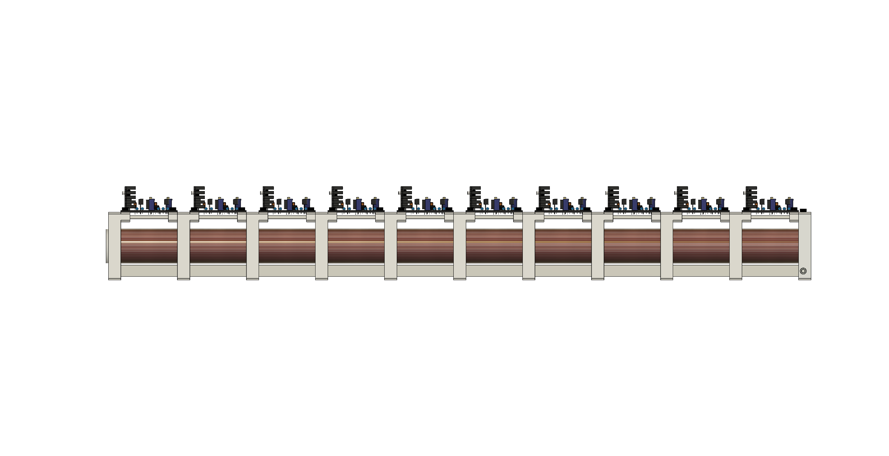
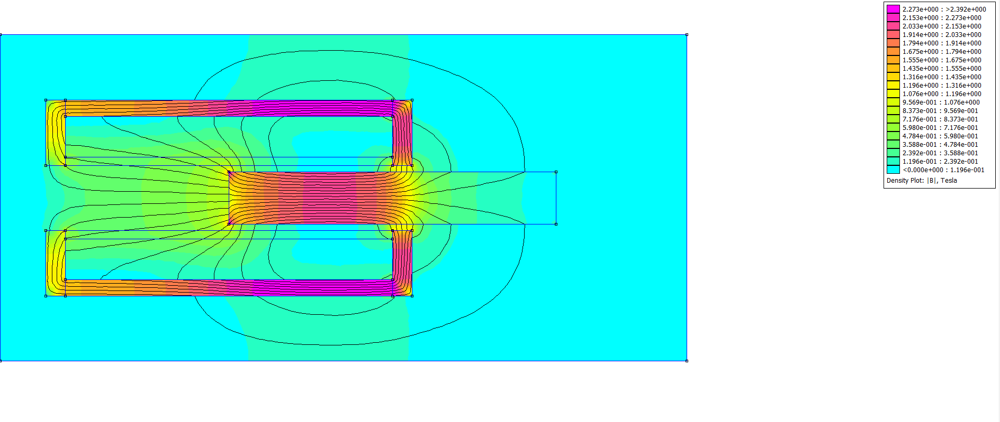
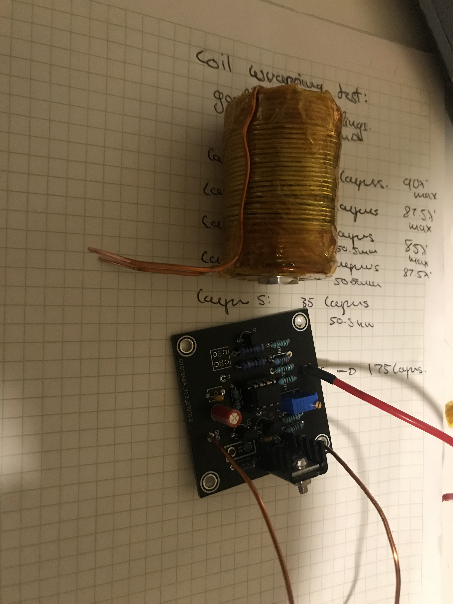

# Modular Battery-Powered Electromagnetic Gun  

## Overview  
This project focuses on **modularity**. Each stage is designed to function independently, allowing me to perfect one module and then stack multiple stages to increase velocity. The launcher accelerates a ferromagnetic projectile using a series of these modular stages.

## How It Works  
Each module consists of three main components:

- **Sensor:** Detects the approaching projectile  
- **Switch:** Powers the coil when triggered by the sensor  
- **Coil:** Generates a magnetic field that pulls the projectile forward

The coil is turned off just before the projectile reaches its center to maximize acceleration. If the coil stays on too long, the projectile would be pulled back and forth, ultimately stopping in the center.

## Performance  
- Reached a maximum velocity of approximately **12–14 m/s**  
- Limited by the **2N2222A transistor**, which has a maximum collector-emitter voltage of 40 V  
- Powered by an **18V Lithium-Ion battery pack**, with a max discharge current of ~40 A  

## Coil Specifications  

| Component        | Details                                                                 |
|------------------|-------------------------------------------------------------------------|
| Coil Inductance  | ~0.750 mH                                                               |
| Coil Resistance  | 0.45 Ω                                                                  |
| Number of Turns  | 175                                                                     |
| Inner Diameter   | 12.5 mm                                                                 |
| Outer Diameter   | 35 mm                                                                   |
| Coil Length      | 50 mm                                                                   |
| Barrel Diameter  | 10 mm (carbon fiber tube)                                               |
| Yoke             | 1.5 mm iron wire (2 layers)                                             |
| Wire             | 1.25 mm enamel copper wire (5 layers)                                   |
| Barrel           | Carbon fiber tube (non-conductive, non-magnetic to reduce eddy currents) |

## Notes  
- **Velocity gain per stage decreases over stages**, as shown below. This happens because kinetic energy increases with the square of velocity (E ∝ v²), so each additional stage must deliver more energy to achieve the same increase in speed. Additionally, as the object moves faster, it spends less time in each stage, reducing the time available to apply force - further limiting velocity gain.

  

  *Velocity vs. stage graph for a 20-stage coilgun powered by a 40 A supply, showing diminishing returns in velocity gain per stage. [`/simplified_sim`](./simplified_sim/)*

- Original PCB files were lost — a **new PCB design** is required to rebuild the system  

## Possible Improvements  
- Design built-in **wire channels** between stages  
- Use a **separate power supply** for NMOS driver circuitry to support higher coil voltages  
- Apply **optimization algorithms** (random search, evolutionary techniques) to improve coil geometry  
- Add a **capacitor bank** for higher velocity (at the cost of overall efficiency)  

## Demo  
  
*3-stage version @ ~30 V DC*

## Visuals  
**FEMM post-processor output of the coil & projectile**  

**Coil & driver board**  

**Finished 10-stage version**  

## Future Work  
- A full write-up will be published soon on my website  
- A **coil geometry optimizer** will be created using my existing BLDC motor optimization framework  
- Work on **Version 2** is planned for 2028 — five years after the original build
