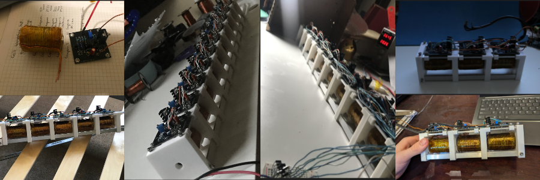
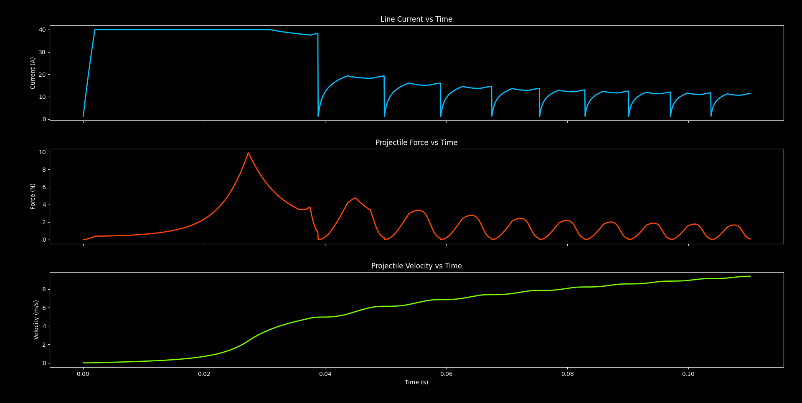
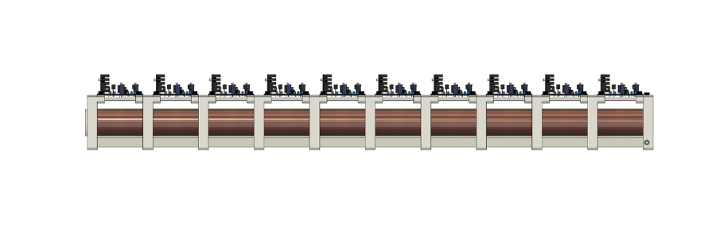

---
Whats the most exciting area in physics? Well obviously electromagnetism. 
So naturally as a 14-year old I wanted to build a device to do with it. 
After watching a few youtube videos, I discovered the idea of a
coilgun. 
A device that used invisible fields to accelerate metal to high speeds.

# Overview


This project focused on modularity with much prototyping going into the a singular stage. 
Then the perfected stage was then stacked into a group of 10. 
The final ```10 stage``` prototype achieved a velocity of ```14 m/s``` and a maximal current of ```40 A```. 
The total cost of the launcher was ```~$200 AUS``` in 2022.

### How does it work?

When you have moving charge within a conductor like a loop of wire, a magnetic field is formed. 
This field wants to decrease local resistance to flow easier. 
So materials with a specific structures experience a force trying to align them with the field. 
If you increase the number of loops and/or the amount of charge. 
The force grows so powerful that it can move large objects around. 
To use this property we have to engineer it, so each consists of three main elements:

- **Sensor:**   Detects the approaching projectile  
- **Switch:**   Powers the coil when triggered by the sensor  
- **Coil:**     Generates a magnetic field that pulls the projectile forward

The mechanics are quite eloquent though inefficient, the coil is turned on by a projectile passing the sensor which triggers the switch. 
The charge is than allowed to flow until the projectile reaches the center where the switch is turned off; 
which collapse the magnetic field resulting in the projectile continuing off into space. However if the coil isn't switch, 
the projectile will oscillate and ultimately stop were its alignment is best. This is often the center but depends on geometry.

# Pre-design: The simulator

To understand the dynamics of such a complex system, a lumped parameter model was made that solves a few
different equations as a approximal solution. It uses ralston's method for current flow and euler method for
motional modelling. The force is modelled using a overlapping boundary method and a analytical formula for 
the Ampere-Maxwell Law.



As you can see from the graph above, coil-guns gain most of their velocity on the first few stages with smaller
and smaller returns for each new stage. This is caused by the amount of energy to accelerate increasing with velocity.
It is also caused by ```LR``` setting time, often as a coil gets bigger it takes more time for current to ramp up. So
your effective current is ```1/10th``` or ```1/5th``` of the first stage. 
Lastly due to the projectile velocity ```dλ/dt``` starts to sag the effective voltage but nevertheless just go to [`/simulator`](./simulator/) and try it yourself. 
Perhaps you could built a better design than me.

# Build: First time the charm?

So each stage had a coil with approximately ```175 turns```, ```~0.750 mH``` and ```0.25 Ω```. 
This coil was driven by a N-MOSFET though a transistor network and a 555 timer IC. 
The 555 timer was triggered by a UV photo-diode or a bypass button. Pulse length was configurable using a ```0-10 kΩ``` potentiometer. 
The design worked quite well as stated above however due to over-heating the triggering transistors for the N-MOS were cooked for all but 3 stages after ```~100``` tests. 

| Component        | Details                                                                 |
|------------------|-------------------------------------------------------------------------|
| Coil Inductance  | ~0.750 mH                                                               |
| Coil Resistance  | 0.25 Ω                                                                  |
| Number of Turns  | 175                                                                     |
| Inner Diameter   | 12.5 mm                                                                 |
| Outer Diameter   | 35 mm                                                                   |
| Coil Length      | 50 mm                                                                   |
| Barrel Diameter  | 10 mm (carbon fiber tube)                                               |
| Yoke             | 1.5 mm iron wire (2 layers)                                             |
| Wire             | 1.25 mm enamel copper wire (5 layers)                                   |
| Barrel           | Carbon fiber tube (non-conductive, non-magnetic to reduce eddy currents) |

3-stage demo at ~30V DC that resulted in a exit velocity of ```10.2m/s``` and kinetic energy of ```1.14J```. 
Interestingly the 3-stage version performance quite well on this demonstration achieving about ```~70%``` of the velocity as the 10-stage version.

[](https://youtu.be/GZpUrEFjWWc)  


To improve the design the triggering transistors should be replaced with either a gate driver or simply a higher rated
BJT transistor. Another consideration is to if the iron wire yoke actually improves efficiency or not. Because the yoke
should improve the ```F/I``` but it also increases the ```LR``` time constant, so most likely its a balancing act. Lastly the original pcb files were lost due to my phone being damaged.

## Future work
To continue from here a coupled multi-physics model will be made to more accurately model the coilgun. 
Most likely quasi-transient magneto, thermo and electro loop using FEM. That loop should allow for trend off analysis like yoke size, etc. 
The plan is to continue work in late 2027 - early 2028 due to it being five years since the original build.


### Bibtex Citation:

```
@misc{Bowley_2023,
  author = {Bowley, William},
  title = {{CoilGun}},
  url = {https://github.com/wgbowley/CoilGun},
  year = {2023},
  note = {GitHub repository},
  license = {MIT}
}
```